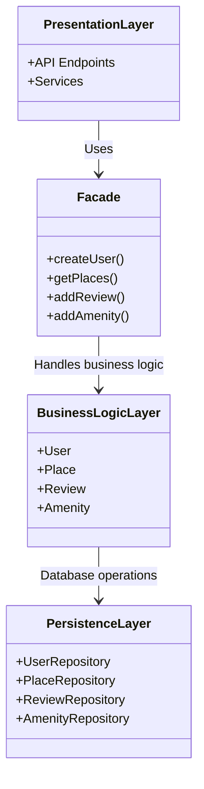
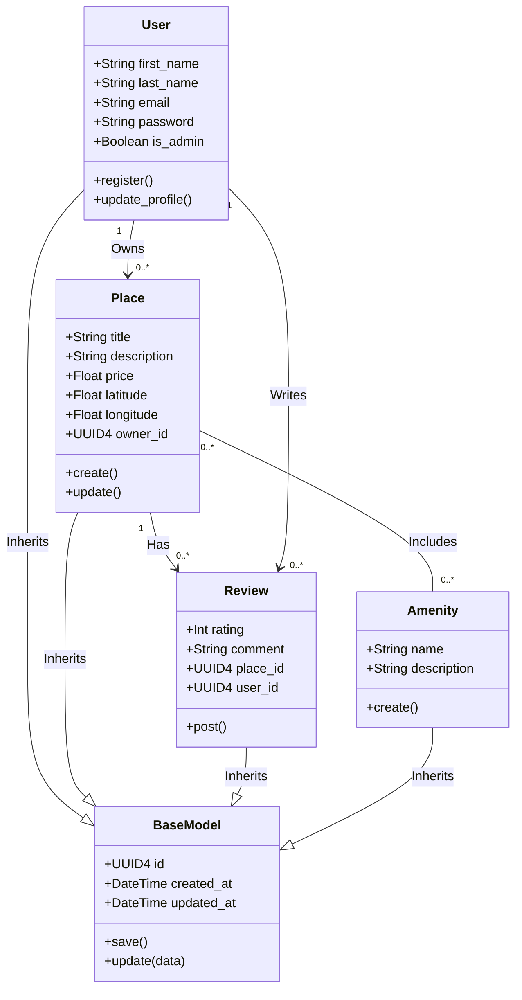
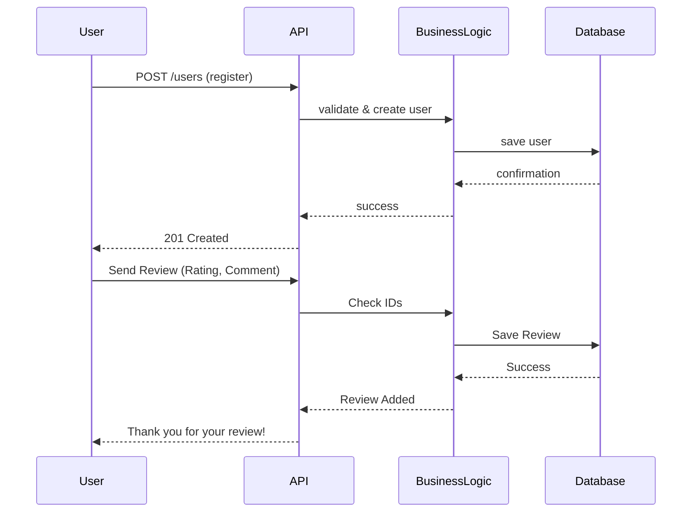

# HBnB – Technical Documentation  

## TASK 0 - High-Level Package Diagram  

---

## Overview  
This document presents a high-level package diagram of the HBnB Evolution application. It describes a three-layer architecture and illustrates how these layers communicate using the Facade design pattern.  

The purpose of this documentation is to provide a clear understanding of the system structure, its components, and how different parts interact with each other.

---

## Architecture Overview  
The HBnB application is designed using a layered architecture consisting of three main layers:  

1. Presentation Layer  
2. Business Logic Layer  
3. Persistence Layer  

Each layer has a specific responsibility and interacts with other layers in a structured and controlled manner.

---

## Layer Descriptions  

### 1. Presentation Layer  
This layer represents the interface between the user and the system. It includes API endpoints and services that handle incoming user requests.  

When a user performs an action, the request is received in this layer and passed through the Facade.

---
### 2. Business Logic Layer  
This layer contains the core logic of the application. It includes the main entities:  

- User  
- Place  
- Review  
- Amenity  

Responsibilities include applying business rules, validating data, and controlling application behavior.

---

### 3. Persistence Layer  
This layer is responsible for storing and retrieving data from the database.  

It includes:  
- UserRepository  
- PlaceRepository  
- ReviewRepository  
- AmenityRepository  

---

## Facade Pattern  

The Facade acts as an intermediary between layers and provides a unified interface.

### Benefits:  
- Single entry point  
- Reduced complexity  
- Improved maintainability  

---

## Package Diagram

------

# 📍TASK 1 -Business Logic Layer

   ## Overview
   
      This document describes the **Business Logic layer** of the HBnB application. It provides a detailed UML 
      class diagram representing the core entities of the system, their attributes, methods, and relationships.
      The main goal is to clearly model how the business logic of the application is structured and how the main 
      entities interact with each other.
   
---
   
   ## Business Logic Layer
   
      The Business Logic layer contains the core entities of the application:
      - User
      - Place
      - Review
      - Amenity
      These entities define the main functionality of the system and enforce business rules.
   
---

## Class Diagram

---

# 📍TASK 2 - API Calls

   ## Overview
      This document shows 2 main API flows in the HBnB application using sequence diagrams.  
      Each diagram illustrates how the Presentation, Business Logic, and Persistence layers interact.
   
---

# User Registration

---